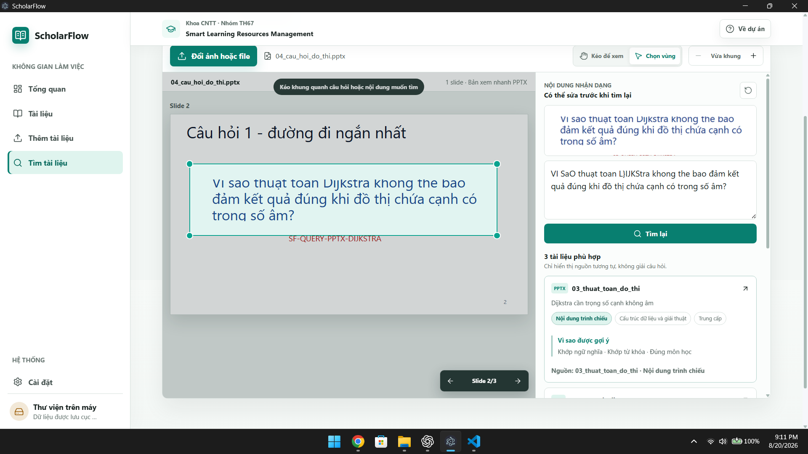
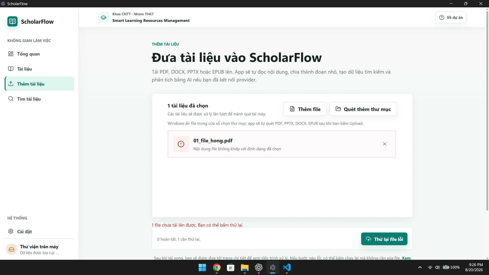
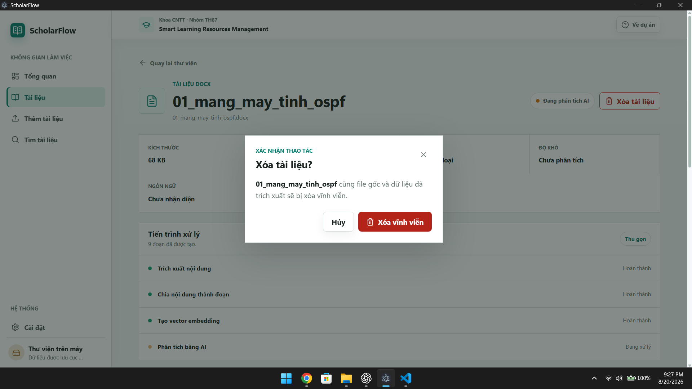

# KẾT QUẢ TEST SCHOLARFLOW

Ngày test: 21/08/2026
Phiên bản/commit: bản chốt local trên nhánh `desktop-app`
Máy/Windows:

Đánh dấu `[x]` khi đạt, `[!]` khi có lỗi.

- [x] 1. Khởi động không có lỗi JavaScript/EPIPE
- [x] 2. BGE-M3 và Docling kiểm tra đều sẵn sàng
- [x] 3. Tạo/đổi tên/xóa chủ đề tạm được
- [x] 4. Hộp kết nối AI mở/đóng đúng
- [x] 5. Thêm DOCX/PDF/PPTX/EPUB thành công
- [x] 6. Quét thư mục nhận 5 file hỗ trợ và bỏ qua TXT
- [x] 7. Xem đủ nội dung bốn định dạng
- [x] 8. Hiện file trong thư mục dùng tên gốc
- [x] 9. Lưu bản sao và trích xuất lại hoạt động
- [x] 10. Năm câu tìm mô tả cho kết quả đúng
- [x] 11. Quay lại từ kết quả giữ nguyên tìm kiếm
- [x] 12. Ảnh OSPF OCR và tìm đúng
- [x] 13. PDF scan đổi trang, OCR và tìm đúng
- [x] 14. DOCX truy vấn cuộn/chọn vùng được, không dính chữ cũ
- [x] 15. PPTX và EPUB truy vấn đổi slide/phần được
- [x] 16. Vùng trắng không tạo kết quả rác
- [x] 17. Pan/zoom/chọn vùng/đổi file hoạt động đúng
- [x] 18. OCR mở rộng không treo và cho sửa chữ
- [x] 19. File quá 40 MB, TXT và PDF hỏng được xử lý rõ
- [x] 20. Đóng/mở app giữ dữ liệu, xóa trong app không xóa file gốc

## Các lỗi phát hiện trong lượt test và trạng thái xử lý

- Đã bỏ nút `Tìm nội dung khác` không cần thiết và sửa mở kết quả tới đúng chunk/trang/slide/phần liên quan trên bốn định dạng.
- Đã sửa preview DOCX nhiều trang để cuộn bằng scrollbar, con lăn và kéo trang.
- Đã thu nhỏ nội dung preview PPTX để không cắt mất chữ. Ảnh ghi nhận ban đầu: 
- File PDF hỏng vẫn được nhận ở bước chọn nhưng bị từ chối rõ ràng khi xử lý; đây là hành vi mong đợi. Ảnh kiểm tra: 
- Đã sửa nội dung xác nhận xóa để nói rõ chỉ xóa bản sao trong ScholarFlow, không xóa file gốc bên ngoài. Ảnh trước khi sửa: 

Pipeline OCR hiện tại được chốt cho MVP vì ổn định và ít case fail hơn các model đã benchmark. Một số nhãn rất ngắn hoặc công thức ảnh phức tạp vẫn có thể sai; người dùng có thể sửa query OCR trước khi tìm. Không đổi model nếu chưa có bộ regression chứng minh cải thiện mà không gây hồi quy.
